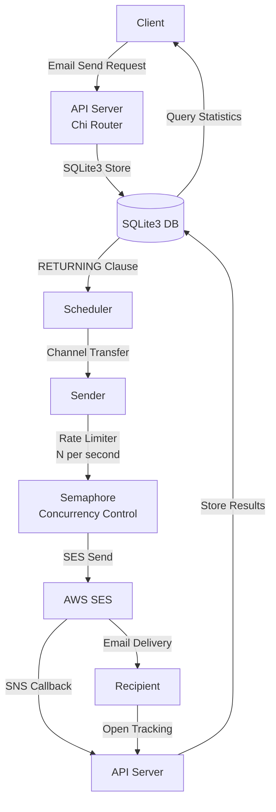

# aws-ses-sender-go

[한국어](README.md) | [English](README.en.md)

AWS SES-based Golang Email Sending Service

## Overview

`aws-ses-sender-go` is a Golang-based service that efficiently sends emails using AWS Simple Email Service (SES). It provides email sending request processing, status tracking, scheduled sending, and result analysis features.

## Key Features

- **AWS SES Email Integration**: Reliable bulk email sending through AWS SES
- **Email Scheduling**: Schedule email delivery at specific times
- **Precise Rate Limiting**: Centralized token bucket algorithm guarantees exactly N emails per second
- **High-Performance Architecture**:
  - Memory-efficient semaphore-based concurrency control
  - Channel-based asynchronous processing
  - Real-time metrics and monitoring (sending rate logged every 5 seconds)
  - Safe termination with graceful shutdown
- **Sending Status Management**: Manage states including created, processing, sent, failed, and stopped
- **Result Tracking and Analysis**:
  - Email open event tracking (using 1x1 pixel images)
  - Store and analyze AWS SES sending results (delivery, failure, bounce)
  - API for querying sending results and statistics by topic/time
- **Lightweight Database**: Easy setup and deployment with SQLite3
- **Sentry Integration**: Error monitoring support

## Architecture

### Workflow

1. **API Server** receives email sending requests (net/http + Chi router)
2. **Scheduler** periodically queries pending send requests from DB (SQLite3 RETURNING clause)
3. Requests are passed from scheduler to sender through **channels**
4. **Sender** controls N emails per second with centralized rate limiter
5. AWS SES sending with **semaphore** limiting concurrent execution
6. Sending results received via **AWS SNS** and stored in DB
7. Email open events recorded with **open tracking**
8. Sending results and statistics queried through **API**



## Database Model

### Content Table

| Field   | Type              | Description       |
| ------- | ----------------- | ----------------- |
| ID      | uint (PK)         | Content unique ID |
| Subject | string (not null) | Email subject     |
| Content | text (not null)   | Email content     |

### Request Table

| Field       | Type                | Description            |
| ----------- | ------------------- | ---------------------- |
| ID          | uint (PK)           | Request unique ID      |
| TopicId     | string (index)      | Email topic identifier |
| MessageId   | string (index)      | SES message identifier |
| To          | string (not null)   | Recipient email        |
| ContentId   | uint (FK, index)    | Content ID reference   |
| ScheduledAt | timestamp (index)   | Scheduled sending time |
| Status      | smallint (not null) | Status code            |
| Error       | string              | Error message          |
| CreatedAt   | timestamp           | Creation time          |
| UpdatedAt   | timestamp           | Update time            |
| DeletedAt   | timestamp           | Deletion time          |

### Result Table

| Field     | Type                     | Description           |
| --------- | ------------------------ | --------------------- |
| ID        | uint (PK)                | Result unique ID      |
| RequestId | uint (FK, index)         | Request ID reference  |
| Status    | string (not null, index) | Sending result status |
| Raw       | json                     | Raw result data       |
| CreatedAt | timestamp                | Creation time         |
| UpdatedAt | timestamp                | Update time           |
| DeletedAt | timestamp                | Deletion time         |

### Status Codes

- **0**: Created
- **1**: Processing
- **2**: Sent
- **3**: Failed
- **4**: Stopped

## Project Structure

```
aws-ses-sender-go/
├── main.go              # Application entry point
├── api/                 # HTTP API related code
│   ├── handler.go       # API handler functions
│   ├── route.go         # API routing configuration
│   ├── server.go        # HTTP server setup/execution
│   └── middlewares.go   # API authentication middleware
├── cmd/                 # Background job code
│   ├── scheduler.go     # Email sending scheduler
│   └── sender.go        # SES email sending processor
├── config/              # Application configuration
│   ├── env.go           # Environment variable management
│   └── db.go            # Database connection setup
├── model/               # Database models
│   └── email.go         # GORM model definitions
└── pkg/aws/             # AWS service integration
    └── ses.go           # SES email sending
```

## Getting Started

### Prerequisites

- Go 1.24+ development environment
- AWS account and SES service setup
  - Verified sender email/domain
  - IAM user creation with SES permissions
- SQLite 3.35.0+ (RETURNING clause support)
- (Optional) Sentry DSN

### Configuration

Create a `.env` file in the project root with the following environment variables:

```env
# AWS Configuration
AWS_ACCESS_KEY_ID=your_access_key
AWS_SECRET_ACCESS_KEY=your_secret_key
AWS_REGION=ap-northeast-2
EMAIL_SENDER=sender@example.com

# Server and API
SERVER_PORT=3000
API_KEY=your_api_key
SERVER_HOST=http://localhost:3000

# Database (SQLite3)
DB_PATH=./data/app.db

# Sending Control
EMAIL_RATE=14              # Emails per second (required)
MAX_CONCURRENT=28          # Max concurrent executions (default: EMAIL_RATE * 2)

# Sentry (Optional)
SENTRY_DSN=your_sentry_dsn
```

### Installation and Execution

1. Clone the repository:

   ```bash
   git clone <repository_URL>
   cd aws-ses-sender-go
   ```

2. Install dependencies:

   ```bash
   go mod tidy
   ```

3. Create database directory:

   ```bash
   mkdir -p data
   ```

4. Build the application:

   ```bash
   go build -o aws-ses-sender
   ```

5. Run:

   ```bash
   ./aws-ses-sender
   ```

   Or in development mode:

   ```bash
   go run main.go
   ```

## Performance Features

### Rate Limiting

- **Centralized Token Bucket**: All sends pass through a single rate limiter, guaranteeing exactly N emails per second
- **Semaphore Concurrency Control**: Optimal concurrent execution control considering network latency
- **Real-time Monitoring**: Sending rate, success/failure counts logged every 5 seconds

### Memory Efficiency

- **Dynamic Goroutine Creation**: Creates goroutines only as needed (no fixed worker pool)
- **Channel Buffer Optimization**: Efficient processing with 1000 request buffer
- **Content Caching**: Scheduler preloads Content to prevent N+1 queries

### SQLite3 Optimization

- **WAL Mode**: Write-Ahead Logging for improved concurrent read performance
- **64MB Cache**: Fast query performance
- **RETURNING Clause**: Single query for UPDATE + SELECT processing

## API Endpoints

All requests require an `x-api-key` header (with some exceptions).

### Send Email Request

```
POST /v1/messages
```

Request body example:

```json
{
  "messages": [
    {
      "topicId": "promotion-event-2024",
      "emails": ["recipient1@example.com", "recipient2@example.com"],
      "subject": "Special Promotion Notice",
      "content": "<h1>Hello!</h1><p>Check out our special promotion.</p>",
      "scheduledAt": "2024-12-25T10:00:00+09:00"
    }
  ]
}
```

### Query Sending Statistics by Topic

```
GET /v1/topics/:topicId
```

### Email Open Tracking

```
GET /v1/events/open?requestId={requestId}
```

### Query Sending Statistics

```
GET /v1/events/counts/sent?hours={hours}
```

### Receive Sending Results (AWS SNS)

```
POST /v1/events/results
```

## Contributing

1. Fork the repository
2. Create a feature branch (`git checkout -b feature/feature-name`)
3. Commit your changes (`git commit -m 'Add feature'`)
4. Push to the branch (`git push origin feature/feature-name`)
5. Create a Pull Request

## License

This project is distributed under the MIT License. See the [LICENSE](LICENSE) file for more details.
