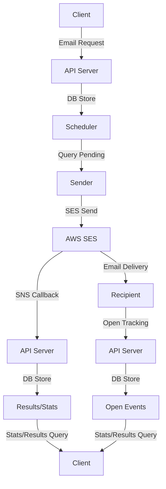

# aws-ses-sender-go

[한국어](README.md) | [English](README.en.md)

AWS SES-based Email Delivery Service in Golang

## Overview

`aws-ses-sender-go` is a Golang-based service that utilizes AWS Simple Email Service (SES) for efficient email delivery. It provides email request processing, status tracking, scheduled sending, and result analysis.

## Key Features

- **AWS SES Integration**: Reliable bulk email delivery through AWS SES
- **Email Scheduling**: Schedule emails for delivery at specific times
- **Stable Delivery**: Reliable and evenly distributed sending considering AWS SES's per-second sending rate
- **Delivery Status Management**: Track email creation, processing, delivery, failure, and cancellation
- **Tracking and Analytics**:
  - Email open event tracking (using 1x1 pixel images)
  - Storage and analysis of AWS SES delivery results (delivered, failed, bounced)
  - Topic-based/time-based delivery results and statistics API
- **Sentry Integration**: Error monitoring support

## Architecture

### Workflow

1. **API Server** receives email delivery requests
2. **Scheduler** periodically queries pending requests from the database
3. **Sender** delivers emails through AWS SES
4. **AWS SNS** receives delivery results and stores them in the database
5. **Open Tracking** records email open events
6. **API** provides delivery results and statistics


```mermaid
flowchart TD
    A[Client] -->|Email Request| B[API Server]
    B -->|DB Store| C[Scheduler]
    C -->|Query Pending| D[Sender]
    D -->|SES Send| E[AWS SES]
    E -->|Email Delivery| F[Recipient]
    E -->|SNS Callback| G[API Server]
    G -->|DB Store| H[Results/Stats]
    F -->|Open Tracking| I[API Server]
    I -->|DB Store| J[Open Events]
    H -->|Stats/Results Query| K[Client]
    J -->|Stats/Results Query| K[Client]
```

## Database Models

### Request Table
| Field | Type | Description |
|------|------|------|
| ID | uint (PK) | Request unique identifier |
| TopicId | string (index) | Email topic identifier |
| MessageId | string (index) | SES message identifier |
| To | string (not null) | Recipient email |
| Subject | string (not null) | Email subject |
| Content | text (not null) | Email content |
| ScheduledAt | timestamp (index) | Scheduled delivery time |
| Status | smallint (not null) | Status code |
| Error | string | Error message |
| CreatedAt | timestamp | Creation time |
| UpdatedAt | timestamp | Update time |
| DeletedAt | timestamp | Deletion time |

### Result Table
| Field | Type | Description |
|------|------|------|
| ID | uint (PK) | Result unique identifier |
| RequestId | uint (FK, index) | Reference to Request ID |
| Status | string (not null, index) | Delivery result status |
| Raw | json | Raw result data |
| CreatedAt | timestamp | Creation time |
| UpdatedAt | timestamp | Update time |
| DeletedAt | timestamp | Deletion time |

### Status Codes
- **0**: Created
- **1**: Processing
- **2**: Sent
- **3**: Failed
- **4**: Stopped

## Project Structure

```
aws-ses-sender-go/
├── main.go              # Application entry point
├── api/                 # HTTP API related code
│   ├── handler.go       # API handler functions
│   ├── route.go         # API routing configuration
│   ├── server.go        # HTTP server setup/execution
│   └── middlewares.go   # API authentication middleware
├── cmd/                 # Background task code
│   ├── scheduler.go     # Pending email scheduler
│   └── sender.go        # SES email delivery processor
├── config/              # Application configuration
│   ├── env.go           # Environment variable management
│   └── db.go            # Database connection setup
├── model/               # Database models
│   └── email.go         # GORM model definitions
└── pkg/aws/             # AWS service integration
    └── ses.go           # SES email delivery
```

## Getting Started

### Prerequisites

- Go language development environment
- AWS account and SES service setup
  - Sender email/domain verification
  - IAM user creation with SES permissions
- PostgreSQL database
- (Optional) Sentry DSN

### Configuration

Create a `.env` file in the project root with the following environment variables:

```env
# AWS Related
AWS_ACCESS_KEY_ID=your_access_key
AWS_SECRET_ACCESS_KEY=your_secret_key
AWS_REGION=ap-northeast-2
EMAIL_SENDER=sender@example.com

# Server and API
SERVER_PORT=3000
API_KEY=your_api_key
SERVER_HOST=http://localhost:3000

# Database (PostgreSQL)
DB_HOST=localhost
DB_PORT=5432
DB_USER=postgres
DB_PASSWORD=postgres
DB_NAME=postgres

# Delivery Control
EMAIL_RATE=14

# Sentry (Optional)
SENTRY_DSN=your_sentry_dsn
```

### Installation and Execution

1. Clone the repository:
   ```bash
   git clone <repository_URL>
   cd aws-ses-sender-go
   ```

2. Install dependencies:
   ```bash
   go mod tidy
   ```

3. Run the application:
   ```bash
   go run main.go
   ```

## API Endpoints

All requests require an `x-api-key` header (with some exceptions).

### Request Email Delivery
```
POST /v1/messages
```

Request body example:
```json
{
  "messages": [
    {
      "topicId": "promotion-event-2024",
      "emails": ["recipient1@example.com", "recipient2@example.com"],
      "subject": "Special Promotion Notice",
      "content": "<h1>Hello!</h1><p>Check out our special promotion.</p>",
      "scheduledAt": "2024-12-25 10:00:00"
    }
  ]
}
```

### Query Topic-based Delivery Statistics
```
GET /v1/topics/:topicId
```

### Email Open Tracking
```
GET /v1/events/open?requestId={requestId}
```

### Query Delivery Statistics
```
GET /v1/events/counts/sent?hours={hours}
```

### Receive Delivery Results (AWS SNS)
```
POST /v1/events/results
```

## Contributing

1. Fork the repository
2. Create a feature branch (`git checkout -b feature/feature-name`)
3. Commit your changes (`git commit -m 'Add feature'`)
4. Push to the branch (`git push origin feature/feature-name`)
5. Create a Pull Request

## License

This project is distributed under the MIT License. See the [LICENSE](LICENSE) file for details.