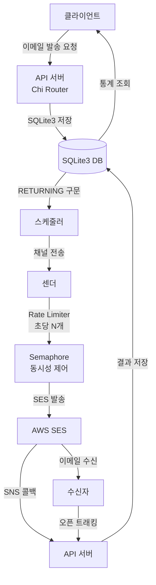

# aws-ses-sender-go

[한국어](README.md) | [English](README.en.md)

AWS SES 기반 Golang 이메일 발송 서비스

## 개요

`aws-ses-sender-go`는 AWS Simple Email Service(SES)를 활용하여 이메일을 효율적으로 발송하는 Golang 기반 서비스입니다. 이메일 발송 요청 처리, 상태 추적, 예약 발송 및 결과 분석 기능을 제공합니다.

## 주요 기능

- **AWS SES 연동 이메일 발송**: AWS SES를 통한 안정적인 대량 이메일 발송
- **이메일 스케줄링**: 특정 시간에 이메일 발송 예약 기능
- **정확한 Rate Limiting**: 중앙 집중식 토큰 버킷 알고리즘으로 초당 정확히 N개 발송 보장
- **고성능 아키텍처**:
  - Semaphore 기반 동시성 제어로 메모리 효율 최적화
  - 채널 기반 비동기 처리
  - 실시간 메트릭 및 모니터링 (5초마다 발송률 로깅)
  - Graceful shutdown으로 안전한 종료
- **발송 상태 관리**: 이메일 생성, 처리, 발송, 실패, 중단 등 상태 관리
- **결과 추적 및 분석**:
  - 이메일 오픈 이벤트 추적 (1x1 픽셀 이미지 활용)
  - AWS SES 발송 결과(전달, 실패, 바운스) 저장 및 분석
  - 토픽별/시간별 발송 결과 및 통계 조회 API
- **경량 데이터베이스**: SQLite3 기반으로 간편한 설정 및 배포
- **Sentry 연동**: 에러 모니터링 지원

## 아키텍처

### 동작 흐름

1. **API 서버**가 이메일 발송 요청 수신 (net/http + Chi 라우터)
2. **스케줄러**가 DB에서 발송 대기 요청 주기적 조회 (SQLite3 RETURNING 구문)
3. **채널**을 통해 스케줄러에서 센더로 요청 전달
4. **센더**가 중앙 집중식 Rate Limiter로 초당 N개 제어
5. **Semaphore**로 동시 실행 수 제한하며 AWS SES 발송
6. **AWS SNS**를 통해 발송 결과 수신 및 DB 저장
7. **오픈 트래킹**으로 이메일 열람 이벤트 기록
8. **API**를 통한 발송 결과 및 통계 조회



## 데이터베이스 모델

### Content 테이블

| 필드    | 타입              | 설명             |
| ------- | ----------------- | ---------------- |
| ID      | uint (PK)         | 내용 고유 식별자 |
| Subject | string (not null) | 이메일 제목      |
| Content | text (not null)   | 이메일 내용      |

### Request 테이블

| 필드        | 타입                | 설명               |
| ----------- | ------------------- | ------------------ |
| ID          | uint (PK)           | 요청 고유 식별자   |
| TopicId     | string (index)      | 이메일 주제 식별자 |
| MessageId   | string (index)      | SES 메시지 식별자  |
| To          | string (not null)   | 수신자 이메일      |
| ContentId   | uint (FK, index)    | Content ID 참조    |
| ScheduledAt | timestamp (index)   | 예약 발송 시간     |
| Status      | smallint (not null) | 상태 코드          |
| Error       | string              | 오류 메시지        |
| CreatedAt   | timestamp           | 생성 시간          |
| UpdatedAt   | timestamp           | 수정 시간          |
| DeletedAt   | timestamp           | 삭제 시간          |

### Result 테이블

| 필드      | 타입                     | 설명             |
| --------- | ------------------------ | ---------------- |
| ID        | uint (PK)                | 결과 고유 식별자 |
| RequestId | uint (FK, index)         | Request ID 참조  |
| Status    | string (not null, index) | 발송 결과 상태   |
| Raw       | json                     | 원시 결과 데이터 |
| CreatedAt | timestamp                | 생성 시간        |
| UpdatedAt | timestamp                | 수정 시간        |
| DeletedAt | timestamp                | 삭제 시간        |

### 상태 코드 (Status)

- **0**: 생성 완료 (Created)
- **1**: 처리 중 (Processing)
- **2**: 발송 완료 (Sent)
- **3**: 실패 (Failed)
- **4**: 중단 (Stopped)

## 프로젝트 구조

```
aws-ses-sender-go/
├── main.go              # 애플리케이션 진입점
├── api/                 # HTTP API 관련 코드
│   ├── handler.go       # API 핸들러 함수
│   ├── route.go         # API 라우팅 설정
│   ├── server.go        # HTTP 서버 설정/실행
│   └── middlewares.go   # API 인증 미들웨어
├── cmd/                 # 백그라운드 작업 코드
│   ├── scheduler.go     # 발송 대기 이메일 스케줄러
│   └── sender.go        # SES 이메일 발송 처리
├── config/              # 애플리케이션 설정
│   ├── env.go           # 환경 변수 관리
│   └── db.go            # 데이터베이스 연결 설정
├── model/               # 데이터베이스 모델
│   └── email.go         # GORM 모델 정의
└── pkg/aws/             # AWS 서비스 연동
    └── ses.go           # SES 이메일 발송
```

## 시작하기

### 사전 준비 사항

- Go 1.24+ 개발 환경
- AWS 계정 및 SES 서비스 설정
  - 발신자 이메일/도메인 인증
  - IAM 사용자 생성 및 SES 권한 부여
- SQLite 3.35.0+ (RETURNING 구문 지원)
- (선택) Sentry DSN

### 설정

`.env` 파일을 프로젝트 루트에 생성하여 다음 환경 변수를 설정하세요:

```env
# AWS 관련
AWS_ACCESS_KEY_ID=your_access_key
AWS_SECRET_ACCESS_KEY=your_secret_key
AWS_REGION=ap-northeast-2
EMAIL_SENDER=sender@example.com

# 서버 및 API
SERVER_PORT=3000
API_KEY=your_api_key
SERVER_HOST=http://localhost:3000

# 데이터베이스 (SQLite3)
DB_PATH=./data/app.db

# 발송 제어
EMAIL_RATE=14              # 초당 발송 수 (필수)
MAX_CONCURRENT=28          # 최대 동시 실행 수 (기본값: EMAIL_RATE * 2)

# Sentry (선택)
SENTRY_DSN=your_sentry_dsn
```

### 설치 및 실행

1. 저장소 복제:

   ```bash
   git clone <저장소_URL>
   cd aws-ses-sender-go
   ```

2. 의존성 설치:

   ```bash
   go mod tidy
   ```

3. 데이터베이스 디렉토리 생성:

   ```bash
   mkdir -p data
   ```

4. 애플리케이션 빌드:

   ```bash
   go build -o aws-ses-sender
   ```

5. 실행:

   ```bash
   ./aws-ses-sender
   ```

   또는 개발 모드:

   ```bash
   go run main.go
   ```

## 성능 특징

### Rate Limiting

- **중앙 집중식 토큰 버킷**: 모든 발송이 단일 rate limiter를 통과하여 정확히 초당 N개 보장
- **Semaphore 동시성 제어**: 네트워크 지연을 고려한 최적 동시 실행 수 제어
- **실시간 모니터링**: 5초마다 발송률, 성공/실패 건수 로깅

### 메모리 효율

- **동적 goroutine 생성**: 필요한 만큼만 goroutine 생성 (고정 워커 풀 없음)
- **채널 버퍼 최적화**: 1000개 요청 버퍼로 효율적인 처리
- **Content 캐싱**: 스케줄러에서 Content를 미리 로드하여 N+1 쿼리 방지

### SQLite3 최적화

- **WAL 모드**: Write-Ahead Logging으로 동시 읽기 성능 향상
- **64MB 캐시**: 빠른 쿼리 성능
- **RETURNING 구문**: 단일 쿼리로 UPDATE + SELECT 처리

## API 엔드포인트

모든 요청에는 `x-api-key` 헤더가 필요합니다(일부 예외).

### 이메일 발송 요청

```
POST /v1/messages
```

요청 본문 예시:

```json
{
  "messages": [
    {
      "topicId": "promotion-event-2024",
      "emails": ["recipient1@example.com", "recipient2@example.com"],
      "subject": "특별 프로모션 안내",
      "content": "<h1>안녕하세요!</h1><p>특별 프로모션 내용을 확인하세요.</p>",
      "scheduledAt": "2024-12-25T10:00:00+09:00"
    }
  ]
}
```

### 토픽별 발송 통계 조회

```
GET /v1/topics/:topicId
```

### 이메일 오픈 추적

```
GET /v1/events/open?requestId={requestId}
```

### 발송 통계 조회

```
GET /v1/events/counts/sent?hours={hours}
```

### 발송 결과 수신 (AWS SNS)

```
POST /v1/events/results
```

## 기여하기

1. 저장소 포크
2. 기능 브랜치 생성 (`git checkout -b feature/기능명`)
3. 변경사항 커밋 (`git commit -m '기능 추가'`)
4. 브랜치에 푸시 (`git push origin feature/기능명`)
5. Pull Request 생성

## 라이센스

이 프로젝트는 MIT 라이센스 하에 배포됩니다. 자세한 내용은 [LICENSE](LICENSE) 파일을 참조하세요.
